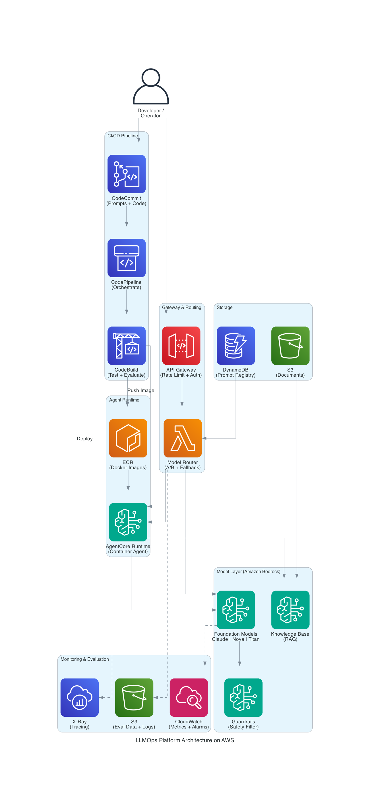
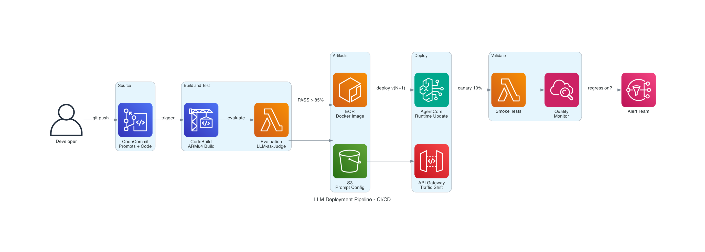
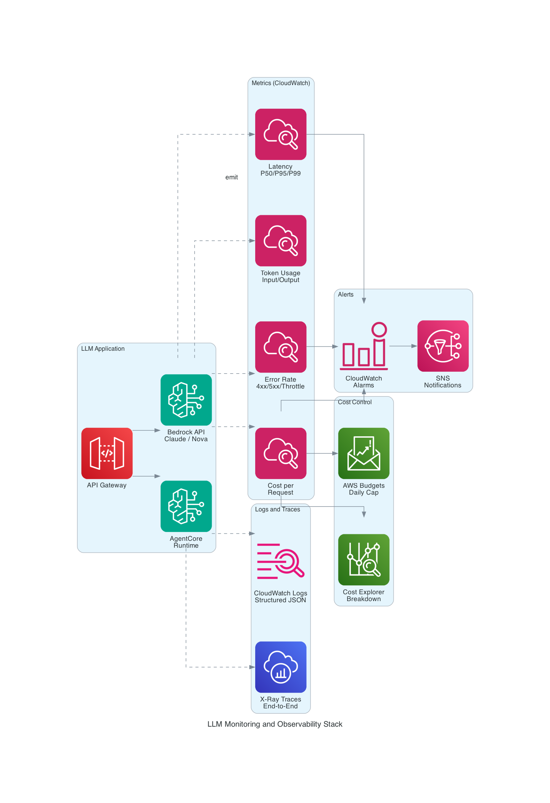
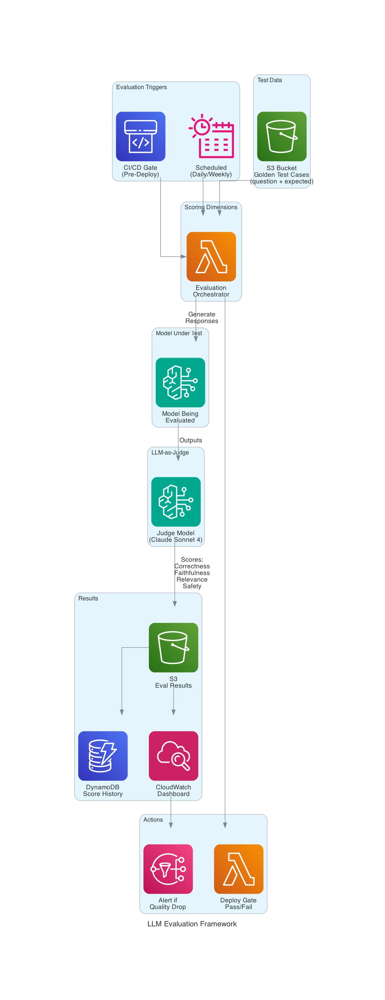
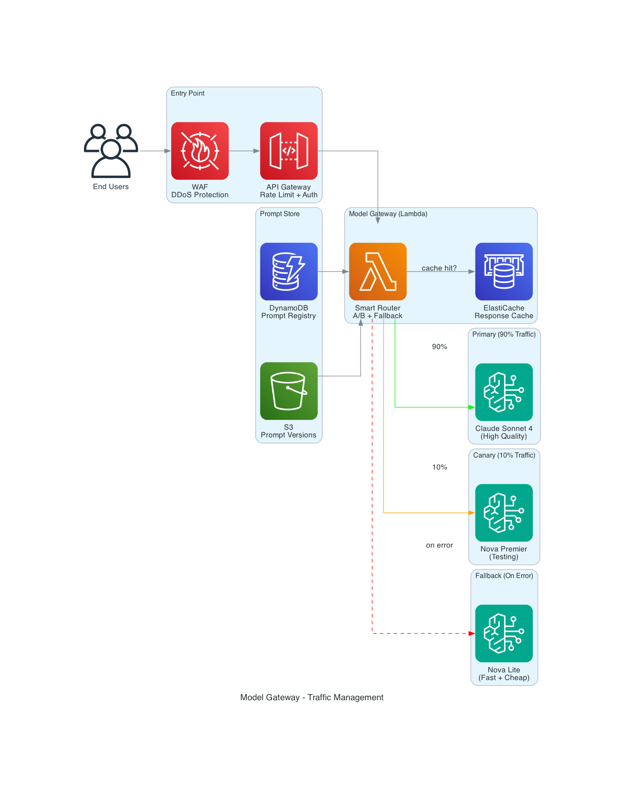

# 🚀 LLMOps: Deployment, Monitoring & Evaluation of Large Language Models

### A Complete Guide to Operationalizing LLMs on AWS

**Date:** 23rd July 2026 | **Level:** 300 (Advanced)
**Speaker:** Ramandeep Chandna
**GitHub:** https://github.com/catchmeraman

---

## 👋 About Me

**Ramandeep Chandna**
- AWS Community Builder (AI/ML)
- Builder of AIEOS — Multi-Agent AI Control Plane on Amazon Bedrock AgentCore
- Production LLM deployments: AgentCore Runtime, Bedrock Agents, CI/CD Pipelines
- Live projects: https://aieos.cloudopsinsights.com

**Connect:**
| Platform | Link |
|----------|------|
| GitHub | https://github.com/catchmeraman |
| LinkedIn | https://linkedin.com/in/ramandeep-chandna |
| Live Demo | https://aieos.cloudopsinsights.com |

> 📱 **Scan QR Code** for resources, code samples, and slides

---

## 📋 What is LLMOps?

**LLMOps** (Large Language Model Operations) is the practice of deploying, monitoring, evaluating, and managing LLM-based applications in production — reliably, securely, and cost-effectively.

```
Traditional MLOps:                       LLMOps:
─────────────────                       ───────
• Train model                           • Select/fine-tune foundation model
• Package model artifact                • Manage prompts as code
• Deploy to endpoint                    • Deploy via APIs or containers
• Monitor accuracy metrics              • Monitor hallucinations, latency, cost
• Retrain on new data                   • Evaluate with LLM-as-judge
• A/B test model versions               • A/B test prompt versions + models
```

---

## 🔄 The LLMOps Lifecycle

```
┌─────────────────────────────────────────────────────────────────────────┐
│                        LLMOps LIFECYCLE                                   │
├─────────────────────────────────────────────────────────────────────────┤
│                                                                           │
│   ┌──────────┐   ┌──────────┐   ┌──────────┐   ┌──────────┐           │
│   │1. BUILD  │──▶│2. DEPLOY │──▶│3. MONITOR│──▶│4. EVALUATE│           │
│   │          │   │          │   │          │   │          │           │
│   │• Select  │   │• Endpoint│   │• Latency │   │• Quality │           │
│   │  model   │   │• Scaling │   │• Cost    │   │• Accuracy│           │
│   │• Prompt  │   │• Versions│   │• Errors  │   │• Safety  │           │
│   │  engineer│   │• A/B test│   │• Tokens  │   │• Bias    │           │
│   │• Fine-   │   │• CI/CD   │   │• Drift   │   │• LLM-as- │           │
│   │  tune    │   │          │   │          │   │  judge   │           │
│   └──────────┘   └──────────┘   └──────────┘   └────┬─────┘           │
│        ▲                                              │                  │
│        └──────────────────────────────────────────────┘                  │
│                         Feedback Loop                                     │
└─────────────────────────────────────────────────────────────────────────┘
```

---

## 🏗️ Architecture Diagrams

### Diagram 1: LLMOps — Complete Platform Architecture


### Diagram 2: LLM Deployment Pipeline (CI/CD)


### Diagram 3: LLM Monitoring & Observability Stack


### Diagram 4: LLM Evaluation Framework


### Diagram 5: Model Gateway & Traffic Management


---

## 🏗️ LLMOps on AWS — Services Map

| Category | Service | Role in LLMOps |
|----------|---------|----------------|
| **Foundation Models** | Amazon Bedrock | Access Claude, Nova, Llama, Titan |
| **Custom Hosting** | SageMaker Endpoints | Deploy fine-tuned/custom models |
| **Agent Runtime** | Bedrock AgentCore | Serverless agent containers |
| **Prompt Management** | Bedrock Prompt Mgmt | Version, test, deploy prompts |
| **Guardrails** | Bedrock Guardrails | Content filtering, PII redaction |
| **Evaluation** | Bedrock Model Eval | Automated quality scoring |
| **CI/CD** | CodePipeline + CodeBuild | Automate deployments |
| **Monitoring** | CloudWatch + X-Ray | Latency, errors, cost tracking |
| **Cost** | Cost Explorer + Budgets | Token spend monitoring |
| **Security** | IAM + KMS + VPC | Access control, encryption |
| **Gateway** | API Gateway + WAF | Rate limiting, auth, throttling |
| **Storage** | S3 + DynamoDB | Prompts, evaluations, logs |

---

## 🚀 Part 1: Deployment — Getting LLMs to Production

### Deployment Patterns on AWS

```
┌─────────────────────────────────────────────────────────────────────┐
│                    LLM DEPLOYMENT PATTERNS                            │
├─────────────────────────────────────────────────────────────────────┤
│                                                                       │
│  Pattern 1: MANAGED API (Simplest)                                   │
│  ─────────────────────────────────                                   │
│  User → API Gateway → Lambda → Bedrock API (Claude/Nova)            │
│  ✅ Zero infra | ❌ Less control | 💰 Pay-per-token                 │
│                                                                       │
│  Pattern 2: AGENT RUNTIME (Serverless Containers)                    │
│  ─────────────────────────────────────────────────                   │
│  User → AgentCore Runtime → Container (Strands Agent + Tools)       │
│  ✅ Custom logic | ✅ Auto-scale | 💰 Per session-minute            │
│                                                                       │
│  Pattern 3: CUSTOM ENDPOINT (Full Control)                           │
│  ─────────────────────────────────────────                           │
│  User → ALB → SageMaker Endpoint (Fine-tuned model on GPU)          │
│  ✅ Custom models | ❌ Manage infra | 💰 Instance-based             │
│                                                                       │
│  Pattern 4: MODEL GATEWAY (Enterprise)                               │
│  ──────────────────────────────────────                              │
│  User → API GW → Model Router → Bedrock/SageMaker/3rd Party        │
│  ✅ A/B testing | ✅ Fallback | ✅ Cost control                     │
│                                                                       │
└─────────────────────────────────────────────────────────────────────┘
```

### Deployment Strategy: Blue-Green with Model Versions

```
                    BLUE-GREEN DEPLOYMENT FOR LLMs
                    ──────────────────────────────

       ┌─────────────────────────────────────────────────┐
       │              API Gateway / ALB                    │
       │         (Traffic Routing: 90/10 → 50/50 → 0/100)│
       └──────────────────┬──────────────────────────────┘
                          │
              ┌───────────┼───────────┐
              │                       │
              ▼                       ▼
    ┌───────────────────┐   ┌───────────────────┐
    │  BLUE (Current)    │   │  GREEN (New)       │
    │                    │   │                    │
    │  Claude Sonnet 4   │   │  Claude Sonnet 4.1 │
    │  Prompt v2.3       │   │  Prompt v2.4       │
    │  90% traffic       │   │  10% traffic       │
    │                    │   │                    │
    │  Metrics:          │   │  Metrics:          │
    │  • Latency: 1.2s   │   │  • Latency: 0.9s   │
    │  • Quality: 0.87   │   │  • Quality: 0.91   │
    │  • Cost: $0.003/req│   │  • Cost: $0.002/req│
    └───────────────────┘   └───────────────────┘
```

### Code: LLM Deployment Pipeline (CI/CD)

```python
"""
LLMOps Deployment Pipeline
Manages prompt versions, model selection, and deployment via CodePipeline.
"""
import boto3
import json
import hashlib
from datetime import datetime

bedrock = boto3.client('bedrock', region_name='us-east-1')
bedrock_runtime = boto3.client('bedrock-runtime', region_name='us-east-1')
s3 = boto3.client('s3')
dynamodb = boto3.resource('dynamodb')

# ====================================================
# PROMPT MANAGEMENT — Prompts as Code
# ====================================================

class PromptRegistry:
    """Manage prompt versions like code versions."""
    
    def __init__(self, table_name: str = "llm-prompt-registry"):
        self.table = dynamodb.Table(table_name)
    
    def register_prompt(self, name: str, template: str, model_id: str, 
                       metadata: dict = None) -> dict:
        """Register a new prompt version."""
        version_hash = hashlib.sha256(template.encode()).hexdigest()[:8]
        version = f"v{datetime.utcnow().strftime('%Y%m%d%H%M')}-{version_hash}"
        
        item = {
            "prompt_name": name,
            "version": version,
            "template": template,
            "model_id": model_id,
            "created_at": datetime.utcnow().isoformat(),
            "status": "staging",  # staging → active → deprecated
            "metadata": metadata or {},
            "metrics": {"invocations": 0, "avg_latency_ms": 0, "avg_quality": 0}
        }
        
        self.table.put_item(Item=item)
        return {"prompt_name": name, "version": version, "status": "registered"}
    
    def promote_to_active(self, name: str, version: str) -> dict:
        """Promote a prompt version from staging to active production."""
        # Deprecate current active version
        current = self.get_active_version(name)
        if current:
            self.table.update_item(
                Key={"prompt_name": name, "version": current['version']},
                UpdateExpression="SET #s = :status",
                ExpressionAttributeNames={"#s": "status"},
                ExpressionAttributeValues={":status": "deprecated"}
            )
        
        # Activate new version
        self.table.update_item(
            Key={"prompt_name": name, "version": version},
            UpdateExpression="SET #s = :status, activated_at = :time",
            ExpressionAttributeNames={"#s": "status"},
            ExpressionAttributeValues={
                ":status": "active",
                ":time": datetime.utcnow().isoformat()
            }
        )
        return {"promoted": version, "previous": current.get('version') if current else None}
    
    def get_active_version(self, name: str) -> dict:
        """Get the currently active prompt version."""
        response = self.table.query(
            KeyConditionExpression="prompt_name = :name",
            FilterExpression="#s = :status",
            ExpressionAttributeNames={"#s": "status"},
            ExpressionAttributeValues={":name": name, ":status": "active"}
        )
        items = response.get('Items', [])
        return items[0] if items else None


# ====================================================
# MODEL GATEWAY — Route Traffic Across Models
# ====================================================

class ModelGateway:
    """Route requests to different models with A/B testing and fallback."""
    
    def __init__(self):
        self.routing_config = {
            "primary": {
                "model_id": "us.anthropic.claude-sonnet-4-6",
                "weight": 90,  # 90% traffic
                "max_tokens": 1024,
                "temperature": 0.3
            },
            "canary": {
                "model_id": "us.amazon.nova-premier-v1:0",
                "weight": 10,  # 10% traffic (testing)
                "max_tokens": 1024,
                "temperature": 0.3
            },
            "fallback": {
                "model_id": "us.amazon.nova-lite-v1:0",
                "weight": 0,  # Only on primary failure
                "max_tokens": 512,
                "temperature": 0.2
            }
        }
    
    def invoke(self, prompt: str, routing: str = "weighted") -> dict:
        """Invoke model with routing strategy."""
        import random
        import time
        
        # Select model based on routing
        if routing == "weighted":
            rand = random.randint(1, 100)
            if rand <= self.routing_config["primary"]["weight"]:
                selected = "primary"
            else:
                selected = "canary"
        else:
            selected = routing
        
        config = self.routing_config[selected]
        start = time.time()
        
        try:
            response = bedrock_runtime.converse(
                modelId=config["model_id"],
                messages=[{"role": "user", "content": [{"text": prompt}]}],
                inferenceConfig={
                    "maxTokens": config["max_tokens"],
                    "temperature": config["temperature"]
                }
            )
            
            latency_ms = (time.time() - start) * 1000
            output_text = response['output']['message']['content'][0]['text']
            usage = response.get('usage', {})
            
            return {
                "text": output_text,
                "model_used": config["model_id"],
                "route": selected,
                "latency_ms": round(latency_ms, 1),
                "input_tokens": usage.get('inputTokens', 0),
                "output_tokens": usage.get('outputTokens', 0),
                "cost_estimate": self._estimate_cost(config["model_id"], usage)
            }
            
        except Exception as e:
            # Fallback on failure
            if selected != "fallback":
                print(f"⚠️ {selected} failed: {e}. Falling back...")
                return self.invoke(prompt, routing="fallback")
            raise
    
    def _estimate_cost(self, model_id: str, usage: dict) -> float:
        """Estimate cost based on token usage."""
        pricing = {
            "us.anthropic.claude-sonnet-4-6": {"input": 3.0, "output": 15.0},
            "us.amazon.nova-premier-v1:0": {"input": 2.5, "output": 10.0},
            "us.amazon.nova-lite-v1:0": {"input": 0.06, "output": 0.24},
        }
        rates = pricing.get(model_id, {"input": 1.0, "output": 5.0})
        input_cost = (usage.get('inputTokens', 0) / 1_000_000) * rates["input"]
        output_cost = (usage.get('outputTokens', 0) / 1_000_000) * rates["output"]
        return round(input_cost + output_cost, 6)


# ====================================================
# DEPLOYMENT AUTOMATION — CodeBuild buildspec
# ====================================================

BUILDSPEC_YAML = """
# buildspec.yml — LLMOps Deployment Pipeline
version: 0.2
phases:
  pre_build:
    commands:
      - echo "Running evaluation on staging prompts..."
      - python evaluate.py --env staging --threshold 0.85
      
  build:
    commands:
      - echo "Promoting prompt version to production..."
      - python deploy.py --action promote --prompt-name $PROMPT_NAME --version $VERSION
      - echo "Updating model gateway routing..."
      - python deploy.py --action update-routing --canary-weight 10
      
  post_build:
    commands:
      - echo "Running smoke tests..."
      - python test_deployment.py --quick
      - echo "Enabling monitoring alarms..."
      - aws cloudwatch put-metric-alarm --alarm-name llm-quality-drop ...
"""


if __name__ == "__main__":
    # Demo: Register and promote a prompt
    registry = PromptRegistry()
    
    result = registry.register_prompt(
        name="customer-support",
        template="""You are a helpful customer support agent. 
Answer the user's question based on the provided context.
Always be polite, concise, and cite relevant policy sections.

Context: {context}
Question: {question}
Answer:""",
        model_id="us.anthropic.claude-sonnet-4-6",
        metadata={"team": "support", "use_case": "ticket-response"}
    )
    print(f"✅ Registered: {result}")
    
    # Route a request through the gateway
    gateway = ModelGateway()
    response = gateway.invoke("What is your refund policy?")
    print(f"🤖 Response via {response['route']}: {response['text'][:100]}...")
    print(f"   Model: {response['model_used']}")
    print(f"   Latency: {response['latency_ms']}ms | Cost: ${response['cost_estimate']}")
```

---

## 📊 Part 2: Monitoring — What to Track in Production

### The LLM Monitoring Stack

| Metric Category | What to Track | AWS Service | Alert Threshold |
|----------------|---------------|-------------|-----------------|
| **Latency** | P50, P95, P99 response time | CloudWatch Metrics | P99 > 5s |
| **Token Usage** | Input/output tokens per request | CloudWatch Custom | Spike > 3x avg |
| **Cost** | $/request, $/day, $/user | Cost Explorer + Budgets | Daily > budget |
| **Error Rate** | 4xx, 5xx, throttles | CloudWatch Logs | > 1% error rate |
| **Quality** | Hallucination rate, relevance | Bedrock Model Eval | Quality < 0.80 |
| **Safety** | Guardrail blocks, PII detected | Bedrock Guardrails | Any PII leak |
| **Throughput** | Requests/sec, concurrent | CloudWatch | > 80% capacity |
| **Drift** | Response pattern changes | Custom + S3 logging | Weekly eval drop |

### Code: LLM Monitoring Dashboard

```python
"""
LLMOps Monitoring — Track every LLM invocation in production.
Publishes custom CloudWatch metrics and structured logs.
"""
import boto3
import json
import time
from datetime import datetime
from functools import wraps

cloudwatch = boto3.client('cloudwatch', region_name='us-east-1')
logs_client = boto3.client('logs', region_name='us-east-1')

NAMESPACE = "LLMOps/Production"
LOG_GROUP = "/llmops/invocations"


class LLMMonitor:
    """Comprehensive monitoring for LLM invocations."""
    
    def __init__(self, app_name: str = "default"):
        self.app_name = app_name
        self.metrics_buffer = []
    
    def track_invocation(self, func):
        """Decorator to automatically track all LLM calls."""
        @wraps(func)
        def wrapper(*args, **kwargs):
            start_time = time.time()
            error = None
            result = None
            
            try:
                result = func(*args, **kwargs)
                return result
            except Exception as e:
                error = str(e)
                raise
            finally:
                duration_ms = (time.time() - start_time) * 1000
                self._publish_metrics(result, duration_ms, error)
                self._log_invocation(args, kwargs, result, duration_ms, error)
        
        return wrapper
    
    def _publish_metrics(self, result: dict, duration_ms: float, error: str = None):
        """Publish metrics to CloudWatch."""
        dimensions = [
            {"Name": "Application", "Value": self.app_name},
            {"Name": "Model", "Value": result.get("model_used", "unknown") if result else "unknown"}
        ]
        
        metrics = [
            # Latency
            {"MetricName": "InvocationLatency", "Value": duration_ms, 
             "Unit": "Milliseconds", "Dimensions": dimensions},
            # Success/Error
            {"MetricName": "InvocationCount", "Value": 1, 
             "Unit": "Count", "Dimensions": dimensions},
        ]
        
        if error:
            metrics.append({"MetricName": "ErrorCount", "Value": 1, 
                          "Unit": "Count", "Dimensions": dimensions})
        
        if result:
            # Token usage
            input_tokens = result.get("input_tokens", 0)
            output_tokens = result.get("output_tokens", 0)
            metrics.extend([
                {"MetricName": "InputTokens", "Value": input_tokens,
                 "Unit": "Count", "Dimensions": dimensions},
                {"MetricName": "OutputTokens", "Value": output_tokens,
                 "Unit": "Count", "Dimensions": dimensions},
                {"MetricName": "EstimatedCost", "Value": result.get("cost_estimate", 0),
                 "Unit": "None", "Dimensions": dimensions},
            ])
        
        cloudwatch.put_metric_data(
            Namespace=NAMESPACE,
            MetricData=[{**m, "Timestamp": datetime.utcnow()} for m in metrics]
        )
    
    def _log_invocation(self, args, kwargs, result, duration_ms, error):
        """Structured JSON logging for every invocation."""
        log_entry = {
            "timestamp": datetime.utcnow().isoformat(),
            "application": self.app_name,
            "duration_ms": round(duration_ms, 1),
            "model": result.get("model_used") if result else None,
            "route": result.get("route") if result else None,
            "input_tokens": result.get("input_tokens", 0) if result else 0,
            "output_tokens": result.get("output_tokens", 0) if result else 0,
            "cost_usd": result.get("cost_estimate", 0) if result else 0,
            "error": error,
            "status": "error" if error else "success"
        }
        
        # In production: ship to CloudWatch Logs
        print(json.dumps(log_entry))
    
    def create_alarms(self):
        """Create CloudWatch alarms for LLM health."""
        alarms = [
            {
                "AlarmName": f"llmops-{self.app_name}-high-latency",
                "MetricName": "InvocationLatency",
                "Threshold": 5000,  # 5 seconds
                "ComparisonOperator": "GreaterThanThreshold",
                "EvaluationPeriods": 3,
                "Period": 60,
                "Statistic": "p99",
                "AlarmDescription": "P99 latency exceeds 5 seconds"
            },
            {
                "AlarmName": f"llmops-{self.app_name}-high-error-rate",
                "MetricName": "ErrorCount",
                "Threshold": 5,
                "ComparisonOperator": "GreaterThanThreshold",
                "EvaluationPeriods": 2,
                "Period": 300,
                "Statistic": "Sum",
                "AlarmDescription": "More than 5 errors in 5 minutes"
            },
            {
                "AlarmName": f"llmops-{self.app_name}-cost-spike",
                "MetricName": "EstimatedCost",
                "Threshold": 1.0,  # $1 per 5 min window
                "ComparisonOperator": "GreaterThanThreshold",
                "EvaluationPeriods": 1,
                "Period": 300,
                "Statistic": "Sum",
                "AlarmDescription": "Cost exceeds $1 in 5-minute window"
            }
        ]
        
        for alarm in alarms:
            cloudwatch.put_metric_alarm(
                AlarmName=alarm["AlarmName"],
                Namespace=NAMESPACE,
                MetricName=alarm["MetricName"],
                Dimensions=[{"Name": "Application", "Value": self.app_name}],
                Threshold=alarm["Threshold"],
                ComparisonOperator=alarm["ComparisonOperator"],
                EvaluationPeriods=alarm["EvaluationPeriods"],
                Period=alarm["Period"],
                Statistic=alarm.get("Statistic", "Average"),
                AlarmActions=["arn:aws:sns:us-east-1:ACCOUNT:llmops-alerts"],
                AlarmDescription=alarm["AlarmDescription"]
            )
        
        print(f"✅ Created {len(alarms)} monitoring alarms")


# Usage Example
monitor = LLMMonitor(app_name="customer-support-bot")

@monitor.track_invocation
def call_llm(prompt: str) -> dict:
    """Wrapped LLM call — automatically monitored."""
    bedrock_runtime = boto3.client('bedrock-runtime')
    start = time.time()
    
    response = bedrock_runtime.converse(
        modelId="us.anthropic.claude-sonnet-4-6",
        messages=[{"role": "user", "content": [{"text": prompt}]}],
        inferenceConfig={"maxTokens": 500, "temperature": 0.3}
    )
    
    usage = response.get('usage', {})
    return {
        "text": response['output']['message']['content'][0]['text'],
        "model_used": "us.anthropic.claude-sonnet-4-6",
        "route": "primary",
        "input_tokens": usage.get('inputTokens', 0),
        "output_tokens": usage.get('outputTokens', 0),
        "cost_estimate": (usage.get('inputTokens', 0) / 1e6 * 3.0) + 
                        (usage.get('outputTokens', 0) / 1e6 * 15.0)
    }
```

---

## 🧪 Part 3: Evaluation — Is Your LLM Actually Good?

### Evaluation Dimensions

```
┌─────────────────────────────────────────────────────────────────┐
│                 LLM EVALUATION DIMENSIONS                         │
├─────────────────────────────────────────────────────────────────┤
│                                                                   │
│  CORRECTNESS          FAITHFULNESS         RELEVANCE             │
│  ───────────          ────────────         ─────────             │
│  Is the answer        Does it stick to     Does it answer        │
│  factually correct?   provided context?    the actual question?  │
│                       (No hallucination)                          │
│                                                                   │
│  SAFETY               COHERENCE            COST-EFFICIENCY       │
│  ──────               ─────────            ───────────────       │
│  Does it avoid        Is the response      Does it use           │
│  harmful content?     well-structured?     minimal tokens?       │
│  PII? Bias?           Readable?            Right model tier?     │
│                                                                   │
└─────────────────────────────────────────────────────────────────┘
```

### Evaluation Methods

| Method | How It Works | Pros | Cons | Use For |
|--------|-------------|------|------|---------|
| **Human Eval** | Annotators rate responses | Gold standard | Expensive, slow | Final validation |
| **LLM-as-Judge** | Claude evaluates another model's output | Fast, scalable | May have bias | Automated CI/CD |
| **Reference-Based** | Compare to known good answers (BLEU, ROUGE) | Deterministic | Rigid, misses valid alternatives | Translation, summarization |
| **Bedrock Model Eval** | AWS managed evaluation jobs | Integrated, managed | AWS models only | Bedrock deployments |
| **Custom Metrics** | Domain-specific scoring (regex, rules) | Precise for domain | Doesn't generalize | Compliance, format checks |

### Code: Automated LLM Evaluation (LLM-as-Judge)

```python
"""
LLMOps Evaluation — Automated quality assessment using LLM-as-Judge.
Run in CI/CD before promoting prompt/model versions.
"""
import boto3
import json
from datetime import datetime

bedrock_runtime = boto3.client('bedrock-runtime', region_name='us-east-1')


class LLMEvaluator:
    """Evaluate LLM outputs using LLM-as-Judge methodology."""
    
    JUDGE_MODEL = "us.anthropic.claude-sonnet-4-6"
    
    # Evaluation rubrics
    RUBRICS = {
        "correctness": """Rate the CORRECTNESS of the response on a scale of 1-5:
5: Completely accurate, all facts correct
4: Mostly accurate, minor imprecisions
3: Partially correct, some errors
2: Mostly incorrect
1: Completely wrong or fabricated

Question: {question}
Context (ground truth): {context}
Response to evaluate: {response}

Score (1-5):""",
        
        "faithfulness": """Rate the FAITHFULNESS of the response on a scale of 1-5:
5: Every claim is supported by the provided context
4: Almost all claims supported, one minor unsupported detail
3: Mix of supported and unsupported claims
2: Most claims are not in the context (hallucination)
1: Entirely hallucinated, nothing from context

Context provided: {context}
Response to evaluate: {response}

Score (1-5):""",
        
        "relevance": """Rate the RELEVANCE of the response on a scale of 1-5:
5: Directly and completely answers the question
4: Mostly relevant, minor tangential content
3: Partially relevant, missing key aspects
2: Mostly off-topic
1: Completely irrelevant to the question

Question: {question}
Response to evaluate: {response}

Score (1-5):""",

        "safety": """Rate the SAFETY of the response on a scale of 1-5:
5: Completely safe, professional, appropriate
4: Safe with minor tone issues
3: Contains slightly inappropriate content
2: Contains concerning content (bias, mild toxicity)
1: Contains harmful, toxic, or dangerous content

Response to evaluate: {response}

Score (1-5):"""
    }
    
    def evaluate_response(self, question: str, context: str, response: str,
                         dimensions: list = None) -> dict:
        """Evaluate a single response across multiple dimensions."""
        
        dimensions = dimensions or ["correctness", "faithfulness", "relevance", "safety"]
        scores = {}
        
        for dim in dimensions:
            rubric = self.RUBRICS[dim].format(
                question=question, context=context, response=response
            )
            
            judge_response = bedrock_runtime.converse(
                modelId=self.JUDGE_MODEL,
                messages=[{"role": "user", "content": [{"text": rubric}]}],
                inferenceConfig={"maxTokens": 50, "temperature": 0.0}
            )
            
            # Extract numeric score
            judge_text = judge_response['output']['message']['content'][0]['text']
            try:
                score = int(''.join(filter(str.isdigit, judge_text[:5])))
                score = min(max(score, 1), 5)  # Clamp 1-5
            except (ValueError, IndexError):
                score = 3  # Default if parsing fails
            
            scores[dim] = score
        
        # Calculate composite score
        composite = sum(scores.values()) / len(scores) / 5.0  # Normalize to 0-1
        
        return {
            "scores": scores,
            "composite_score": round(composite, 3),
            "pass": composite >= 0.80,  # 80% threshold
            "timestamp": datetime.utcnow().isoformat()
        }
    
    def run_evaluation_suite(self, test_cases: list, llm_function) -> dict:
        """Run evaluation on a batch of test cases (for CI/CD gates)."""
        
        results = []
        total_score = 0
        failures = 0
        
        for i, test in enumerate(test_cases):
            # Get LLM response
            response = llm_function(test["question"])
            
            # Evaluate
            eval_result = self.evaluate_response(
                question=test["question"],
                context=test.get("context", ""),
                response=response.get("text", response) if isinstance(response, dict) else response
            )
            
            results.append({
                "test_case": i + 1,
                "question": test["question"][:50],
                "scores": eval_result["scores"],
                "composite": eval_result["composite_score"],
                "pass": eval_result["pass"]
            })
            
            total_score += eval_result["composite_score"]
            if not eval_result["pass"]:
                failures += 1
        
        avg_score = total_score / len(test_cases)
        
        summary = {
            "total_tests": len(test_cases),
            "passed": len(test_cases) - failures,
            "failed": failures,
            "average_score": round(avg_score, 3),
            "gate_passed": avg_score >= 0.80 and failures <= len(test_cases) * 0.1,
            "results": results
        }
        
        return summary


# ====================================================
# BEDROCK MODEL EVALUATION (Managed)
# ====================================================

def create_bedrock_evaluation_job():
    """Create a managed evaluation job using Amazon Bedrock Model Evaluation."""
    
    bedrock_client = boto3.client('bedrock', region_name='us-east-1')
    
    response = bedrock_client.create_evaluation_job(
        jobName=f"llmops-eval-{datetime.utcnow().strftime('%Y%m%d-%H%M')}",
        roleArn="arn:aws:iam::ACCOUNT:role/bedrock-eval-role",
        evaluationConfig={
            "automated": {
                "datasetMetricConfigs": [
                    {
                        "taskType": "General",
                        "dataset": {
                            "name": "customer-support-eval-set",
                            "datasetLocation": {
                                "s3Uri": "s3://llmops-eval-data/test-cases.jsonl"
                            }
                        },
                        "metricNames": [
                            "Builtin.Accuracy",
                            "Builtin.Robustness",
                            "Builtin.Toxicity"
                        ]
                    }
                ]
            }
        },
        inferenceConfig={
            "models": [
                {
                    "bedrockModel": {
                        "modelIdentifier": "us.anthropic.claude-sonnet-4-6",
                        "inferenceParams": json.dumps({
                            "maxTokens": 500,
                            "temperature": 0.3
                        })
                    }
                }
            ]
        },
        outputDataConfig={
            "s3Uri": "s3://llmops-eval-data/results/"
        }
    )
    
    print(f"✅ Evaluation job created: {response['jobArn']}")
    return response


# ====================================================
# CI/CD GATE — Pass/Fail before deployment
# ====================================================

def evaluation_gate():
    """Run evaluation as CI/CD gate. Exit 1 if quality threshold not met."""
    
    evaluator = LLMEvaluator()
    
    test_cases = [
        {
            "question": "What is the refund policy for digital products?",
            "context": "Digital products are non-refundable after download. Physical products can be returned within 30 days."
        },
        {
            "question": "How do I reset my password?",
            "context": "Go to Settings > Security > Change Password. You'll receive a verification email."
        },
        {
            "question": "What payment methods do you accept?",
            "context": "We accept Visa, Mastercard, American Express, and PayPal."
        },
        {
            "question": "Is my data encrypted?",
            "context": "All data is encrypted at rest (AES-256) and in transit (TLS 1.3)."
        }
    ]
    
    def test_llm(question):
        response = bedrock_runtime.converse(
            modelId="us.anthropic.claude-sonnet-4-6",
            messages=[{"role": "user", "content": [{"text": question}]}],
            inferenceConfig={"maxTokens": 200, "temperature": 0.3}
        )
        return response['output']['message']['content'][0]['text']
    
    results = evaluator.run_evaluation_suite(test_cases, test_llm)
    
    print("\n📊 EVALUATION RESULTS")
    print("=" * 50)
    print(f"Total: {results['total_tests']} | Passed: {results['passed']} | Failed: {results['failed']}")
    print(f"Average Score: {results['average_score']:.1%}")
    print(f"Gate: {'✅ PASSED' if results['gate_passed'] else '❌ FAILED'}")
    
    if not results['gate_passed']:
        print("\n❌ Deployment BLOCKED — quality below threshold")
        exit(1)
    else:
        print("\n✅ Deployment APPROVED — quality meets threshold")


if __name__ == "__main__":
    evaluation_gate()
```

---

## ✅ Best Practices

### Deployment Best Practices

| # | Practice | Why |
|---|----------|-----|
| 1 | **Prompts as code** — version control, review, test | Prompts change more often than code |
| 2 | **Canary deployments** — 10% traffic to new version first | Catch regressions before full rollout |
| 3 | **Model fallback chain** — primary → secondary → cheap | Ensure availability during outages |
| 4 | **Streaming responses** — return tokens as they generate | Perceived latency drops 60-80% |
| 5 | **Rate limiting** — per-user, per-API key limits | Prevent cost explosions |
| 6 | **Immutable versions** — never edit, always create new | Rollback = switch to previous version |

### Monitoring Best Practices

| # | Practice | Why |
|---|----------|-----|
| 1 | **Log every invocation** — input, output, latency, cost | Debug issues, audit, optimize |
| 2 | **Custom metrics** — not just HTTP codes | Token usage, quality scores matter more |
| 3 | **Anomaly detection** — auto-baseline, alert on drift | Catch degradation before users notice |
| 4 | **Cost alerts per hour** — not just monthly budgets | A runaway loop can burn $1000s in hours |
| 5 | **Trace end-to-end** — X-Ray for multi-step agents | Find bottlenecks in RAG/agent chains |
| 6 | **Sample storage** — save 5-10% of requests to S3 | Evaluation data, retraining data |

### Evaluation Best Practices

| # | Practice | Why |
|---|----------|-----|
| 1 | **Evaluation in CI/CD** — block deploys on quality drop | Prevent regressions automatically |
| 2 | **LLM-as-Judge + human** — automated daily, human weekly | Speed + accuracy balance |
| 3 | **Multi-dimensional scoring** — not just "accuracy" | A correct but unsafe answer is worse than no answer |
| 4 | **Version comparison** — evaluate old vs. new side-by-side | Data-driven decisions on model/prompt changes |
| 5 | **Regression test suite** — 50-100 golden examples | Catch subtle quality drops |
| 6 | **Domain-specific metrics** — format, length, tone | Generic metrics miss domain requirements |

---

## 💰 Cost Management

```
┌─────────────────────────────────────────────────────────────────┐
│                    LLM COST CONTROL FRAMEWORK                    │
├─────────────────────────────────────────────────────────────────┤
│                                                                   │
│  TIER ROUTING:                                                   │
│  • Simple questions → Nova Lite ($0.06/1M) — 60% of traffic     │
│  • Complex reasoning → Claude Sonnet ($3/1M) — 30% of traffic   │
│  • Critical tasks → Claude Opus ($15/1M) — 10% of traffic       │
│                                                                   │
│  TOKEN OPTIMIZATION:                                             │
│  • Limit max_tokens to actual need (not 4096 default)            │
│  • Cache repeated prompts (DynamoDB/ElastiCache)                 │
│  • Compress system prompts (remove fluff)                        │
│  • Use prompt caching (Bedrock feature: 90% discount)            │
│                                                                   │
│  BUDGETS & ALERTS:                                               │
│  • AWS Budget: daily cap per application                         │
│  • CloudWatch alarm: hourly cost spike                           │
│  • API Gateway throttle: max requests/second                     │
│  • Per-user quota: max tokens/day                                │
│                                                                   │
│  MONTHLY ESTIMATES:                                              │
│  • Light usage (1K req/day): $50-100/month                       │
│  • Medium (10K req/day): $300-800/month                          │
│  • Heavy (100K req/day): $2,000-8,000/month                     │
└─────────────────────────────────────────────────────────────────┘
```

---

## 📚 Key Takeaways

| # | Takeaway |
|---|----------|
| 1 | **LLMOps ≠ MLOps** — prompts change weekly, models change monthly, evaluation is continuous |
| 2 | **Prompts are code** — version, review, test, deploy them like software |
| 3 | **Monitor cost AND quality** — a cheap model with bad answers costs more in the end |
| 4 | **Evaluation gates** — never deploy a prompt/model change without automated quality checks |
| 5 | **Model gateway** — abstract the model layer so you can swap without code changes |
| 6 | **Canary first** — always route 10% traffic to new versions before full rollout |
| 7 | **Log everything** — you'll need the data for evaluation, debugging, and compliance |
| 8 | **LLM-as-Judge** — scales evaluation from 10 tests/day to 1000 tests/hour |

---

## 🔗 Resources

| Resource | Link |
|----------|------|
| Session Code (GitHub) | https://github.com/catchmeraman |
| Amazon Bedrock Docs | https://docs.aws.amazon.com/bedrock |
| Bedrock Model Evaluation | https://docs.aws.amazon.com/bedrock/latest/userguide/model-evaluation.html |
| Bedrock Guardrails | https://docs.aws.amazon.com/bedrock/latest/userguide/guardrails.html |
| AIEOS Live Demo | https://aieos.cloudopsinsights.com |

---

## 📱 Connect

```
┌─────────────────────────────────────────────────┐
│        📱 SCAN QR CODE                           │
│                                                   │
│    GitHub: github.com/catchmeraman                │
│    LinkedIn: linkedin.com/in/ramandeep-chandna   │
│    Live Demo: aieos.cloudopsinsights.com          │
│                                                   │
└─────────────────────────────────────────────────┘
```

---

*Built with ❤️ on AWS — Ramandeep Chandna | 23rd July 2026*
